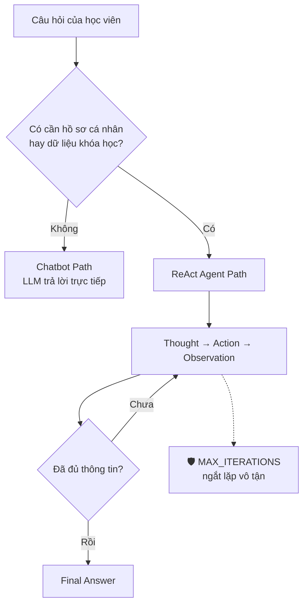

# 🟢 ROLE 1 — PRODUCT ARCHITECT & OBSERVABILITY

| | |
| :-- | :-- |
| **Người đảm nhận** | Nguyễn Tiến Đạt — 2A202601387 |
| **Branch** | `role1-product-architect` |
| **File giữ** | `config/test_cases.json` + `docs/trace_eval.md` |
| **Trọng số điểm** | 20% (Agentic Fit & Test Design) + 10% (Hybrid Flowchart) |

> ℹ️ Vai này gộp Role 1 + Role 5 (nhóm 4 người / 5 vai). Người viết test case hiểu rõ nhất câu nào là bẫy nên soi trace log chính xác nhất.

---

## 🎯 Đề tài nhóm

**Trợ Lý Đăng Ký Khóa Học — marketplace khóa học bên ngoài.**

Có cả khóa **online tự học** lẫn **lớp offline tại trung tâm**, nhiều nhà cung cấp. Học viên định danh bằng **số điện thoại**.

Không phải hệ thống đăng ký môn của trường — không có `mssv`, `ngành`, `môn tiên quyết`. Trục suy luận là **ngân sách + lịch rảnh + trình độ + khu vực + hình thức**.

📦 Dữ liệu: [`config/mock_database.json`](../../config/mock_database.json) — 1000 học viên, 13 khóa. Chi tiết: [DATABASE_SCHEMA.md](../DATABASE_SCHEMA.md).

---

## 📍 MỐC 1 (20 phút) — Scoring Matrix

Mở `docs/trace_eval.md`, chấm 1–5 điểm cho 4 tiêu chí Agentic Fit:

| Tiêu chí | Câu hỏi tự vấn | Điểm |
| :-- | :-- | :-: |
| **Cần dữ liệu ngoài?** | Chatbot có biết ngân sách và lịch rảnh của học viên không? | |
| **Nhiều bước?** | Có phải tra hồ sơ rồi mới biết lọc khóa thế nào? | |
| **Có thao tác thật?** | Agent có phải *kiểm tra* điều kiện không, hay chỉ nói chung chung? | |
| **Rủi ro nếu sai?** | Tư vấn sai khóa 15 triệu thì sao? Có cần Guardrail? | |

Đề này nên được điểm cao ở tiêu chí 1 và 2.

---

## 📍 MỐC 2 (30 phút) — Viết 5 Test Cases

Mở `config/test_cases.json`. Cần đủ 3 nhóm:

| Loại | Số câu | Mục đích |
| :-- | :-: | :-- |
| 🟢 Đơn giản | 2 | Chatbot trả lời được → không phải lúc nào cũng cần Agent |
| 🟡 Multi-step | 2 | Bắt buộc gọi tool, tool sau phụ thuộc tool trước |
| 🔴 Edge case | 1 | Dữ liệu không tồn tại → xem Agent có **bịa** không |

### Mẫu

```json
[
  {
    "id": 1,
    "category": "🟢 Đơn giản (Chỉ cần LLM)",
    "question": "Học IELTS thì nên bắt đầu từ đâu?",
    "expected_behavior": "Chatbot trả lời từ kiến thức có sẵn, không cần tool."
  },
  {
    "id": 3,
    "category": "🟡 Multi-step (Tool sau phụ thuộc tool trước)",
    "question": "Em là 0912345203, em muốn học AI thì nên đăng ký khóa nào?",
    "expected_behavior": "get_learner(0912345203) → biết ngân sách 2tr, mới bắt đầu, rảnh T2/T4 tối → search_courses(AI, 2000000) → check_suitability → gợi ý AI302."
  },
  {
    "id": 4,
    "category": "🟡 Multi-step (Kiểm tra điều kiện)",
    "question": "Em là 0987654387, em đăng ký khóa EN101 được không?",
    "expected_behavior": "Agent phải chỉ ra ĐÚNG 1 lý do trượt: lịch T2/T4 tối không khớp khung rảnh T3/T5 tối."
  },
  {
    "id": 5,
    "category": "🔴 Edge Case (Bẫy Guardrail)",
    "question": "Em là 0000000000, đăng ký giúp em khóa Thôi Miên Nâng Cao ạ.",
    "expected_behavior": "Cả 2 tool trả LỖI. Agent KHÔNG được bịa hồ sơ hay bịa khóa học. Guardrail ngắt sau MAX_ITERATIONS bước, trả lời lịch sự."
  }
]
```

---

## 🎣 Bẫy có sẵn trong dữ liệu — đã kiểm chứng

Dùng bảng này để viết test case, khỏi phải tự dò:

| Học viên | Khóa | Kết quả đúng |
| :-- | :-- | :-- |
| `0912345203` Hướng | `AI301` | **3 lỗi**: vượt ngân sách, trình độ chưa đạt, lịch không khớp |
| `0987654387` Đạt | `EN101` | **1 lỗi**: lịch không khớp |
| `0901234795` Liên | `PR201` | **PHÙ HỢP** |
| `0977888821` Huy | `EN101` | **2 lỗi**: lịch + khác khu vực |
| `0977888821` Huy | `MK201` | **PHÙ HỢP** |
| `0987654387` Đạt | `EN201` | **3 lỗi**: ngân sách, trình độ, **lớp đã đầy** 20/20 |
| `0901234795` Liên | `EN301` | **1 lỗi**: **hết hạn đăng ký** 2026-07-15 |

> 💎 Ba mức **3 lỗi / 1 lỗi / phù hợp** là chỗ đắt nhất — cùng câu hỏi, đổi số điện thoại là ra kết quả khác hẳn. Đây là bằng chứng mạnh nhất rằng Agent tra dữ liệu thật.

Bẫy dành riêng cho câu edge case: SĐT `0000000000` và mã khóa `XYZ999` đều không tồn tại.

---

## 📍 MỐC 3 (60 phút) — Soi Trace Log

Sau khi Huy chạy được Agent, chạy đủ 5 test case rồi dán log vào `docs/trace_eval.md`:

```markdown
### Test Case 4 — Kiểm tra điều kiện
**Câu hỏi**: Em là 0987654387, em đăng ký khóa EN101 được không?

Thought: Cần xem hồ sơ học viên này trước.
Action: get_learner[0987654387]
Observation: Nguyễn Tiến Đạt — mục tiêu tiếng Anh, trình độ cơ bản,
             ngân sách 6,000,000đ, rảnh T3 tối/T5 tối, khu vực Hà Nội.
Thought: Giờ kiểm tra khóa EN101 có phù hợp không.
Action: check_suitability[0987654387, EN101]
Observation: Không phù hợp. Lý do: lịch không khớp (T2 tối, T4 tối).
Thought: Đã rõ nguyên nhân, trả lời học viên.
Final Answer: Khóa EN101 hợp túi tiền và trình độ của bạn, nhưng học T2/T4 tối
              mà bạn chỉ rảnh T3/T5 tối...

**Nhận xét**: ✅ Gọi đúng 2 tool theo thứ tự, chỉ ra đúng 1 lý do trượt, không bịa.
```

Cần **ít nhất 1 trace hoàn chỉnh** để lấy điểm tiêu chí 3.

Đồng thời ghi lại **Chatbot baseline trả lời gì** cho cùng câu đó — bằng chứng so sánh quan trọng nhất của cả bài. Chatbot không biết số điện thoại đó là ai nên chắc chắn sẽ trả lời chung chung hoặc bịa.

---

## 📍 MỐC 4 (40 phút) — Hybrid Flowchart

Tạo `docs/hybrid_flowchart.mermaid`:



---

## 🧪 Tự chấm — chạy bất cứ lúc nào

```bash
.venv\Scripts\python.exe tests\test_role1.py
```

Test này chấm 20 mục và in ra **chính xác còn phải sửa gì**. Nó kiểm cả những thứ dễ sót:

- Số điện thoại bạn viết trong test case có **thật** trong database không (sai một số là Agent trả `LỖI:` và bạn tưởng Agent hỏng)
- Mã khóa học có tồn tại không
- Câu bẫy có thật sự dùng dữ liệu không tồn tại không
- Còn sót từ ngữ của đề tài cũ (trường đại học) không
- `trace_eval.md` đã có đủ Scoring Matrix + trace có `Final Answer` chưa

Chạy tới khi thấy `COVERAGE: 20/20` là xong phần bạn.

---

## ✅ Checklist

- [ ] Mốc 1: Scoring Matrix 4 tiêu chí
- [ ] Mốc 2: 5 test case (2 dễ / 2 multi-step / 1 bẫy)
- [ ] Mốc 2: Ghi lại câu trả lời của Chatbot baseline
- [ ] Mốc 3: Ít nhất 1 trace log hoàn chỉnh
- [ ] Mốc 3: Kiểm tra Agent có vượt được câu bẫy không
- [ ] Mốc 4: Vẽ `docs/hybrid_flowchart.mermaid`

---

## 🔄 Git

```bash
git checkout role1-product-architect
git pull origin main
```

Xong việc:

```bash
git add config/test_cases.json docs/trace_eval.md docs/hybrid_flowchart.mermaid
git commit -m "Role 1: test cases va scoring matrix"
git push origin role1-product-architect
```
