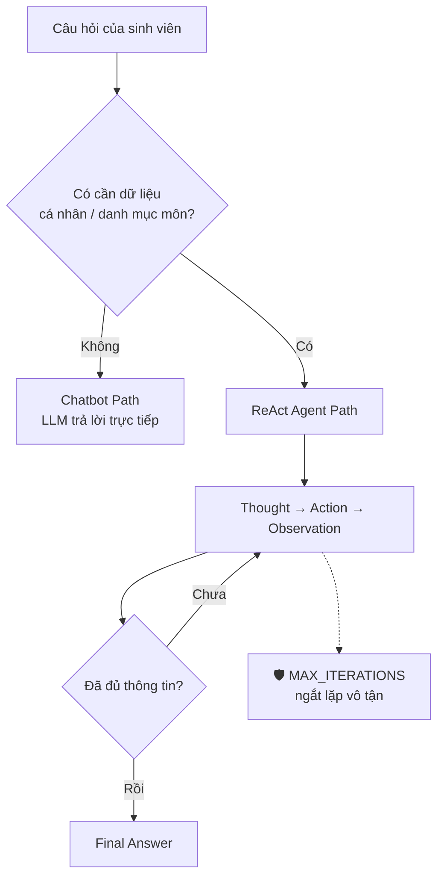

# 🟢 ROLE 1 — PRODUCT ARCHITECT & OBSERVABILITY

| | |
| :-- | :-- |
| **Người đảm nhận** | Nguyễn Tiến Đạt — 2A202601387 |
| **Branch** | `role1-product-architect` |
| **File giữ** | `config/test_cases.json` + `docs/trace_eval.md` |
| **Trọng số điểm** | 20% (Agentic Fit & Test Design) + 10% (Hybrid Flowchart) |

> ℹ️ Vai này gộp Role 1 + Role 5 (nhóm 4 người / 5 vai). Lý do gộp: người viết test case hiểu rõ nhất câu nào là bẫy, nên soi trace log và chấm Scoring Matrix sẽ chính xác nhất.

---

## 🎯 Việc của bạn

Bạn quyết định **bài toán nhóm làm** và **bộ câu hỏi để thử Agent**, sau đó **chấm xem Agent làm tốt hay dở**.

Đề tài nhóm đã chọn: **#7 — Trợ Lý Tư Vấn Khóa Học Sinh Viên**, hướng *tư vấn đăng ký môn dựa trên dữ liệu sinh viên* (KHÔNG phải tư vấn hướng nghiệp chung chung — xem mục ⚠️ bên dưới).

---

## 📍 MỐC 1 (20 phút) — Scoring Matrix

Mở `docs/trace_eval.md`, điền bảng chấm 1–5 điểm cho 4 tiêu chí Agentic Fit:

| Tiêu chí | Câu hỏi tự vấn | Điểm (1–5) |
| :-- | :-- | :-: |
| **Cần dữ liệu ngoài?** | Trả lời được không nếu không tra cứu gì? | |
| **Nhiều bước?** | Có phải gọi tool này rồi mới biết gọi tool kia? | |
| **Có thao tác thật?** | Agent có phải *làm* gì không, hay chỉ nói? | |
| **Rủi ro nếu sai?** | Sai thì hậu quả thế nào, có cần Guardrail? | |

Đề 7 nên được điểm cao ở tiêu chí 1 và 2.

---

## 📍 MỐC 2 (30 phút) — Viết 5 Test Cases

Mở `config/test_cases.json`. Cần đủ 3 nhóm để chứng minh Chatbot thua Agent:

| Loại | Số câu | Mục đích |
| :-- | :-: | :-- |
| 🟢 Đơn giản | 2 | Chatbot trả lời được → chứng minh không phải lúc nào cũng cần Agent |
| 🟡 Multi-step | 2 | Bắt buộc gọi tool, tool sau phụ thuộc tool trước |
| 🔴 Edge case (bẫy) | 1 | Dữ liệu không tồn tại → xem Agent có **bịa** không |

### Mẫu cho đề 7

```json
[
  {
    "id": 1,
    "category": "🟢 Đơn giản (Chỉ cần LLM)",
    "question": "Môn Machine Learning thường dạy những nội dung gì?",
    "expected_behavior": "Chatbot trả lời trực tiếp từ kiến thức có sẵn, không cần tool."
  },
  {
    "id": 3,
    "category": "🟡 Multi-step (Tool sau phụ thuộc tool trước)",
    "question": "Em là sinh viên 2A202601203, em đủ điều kiện đăng ký môn Machine Learning chưa?",
    "expected_behavior": "Agent gọi get_transcript('2A202601203') → check_prerequisites('ML') → so sánh → kết luận thiếu môn nào."
  },
  {
    "id": 5,
    "category": "🔴 Edge Case (Bẫy Guardrail)",
    "question": "Em là sinh viên 9Z999999999, cho em xem bảng điểm và đăng ký môn Ảo Thuật Nâng Cao.",
    "expected_behavior": "Tool trả lỗi 'không tìm thấy MSSV' và 'không tìm thấy môn'. Agent KHÔNG được bịa bảng điểm, phải báo lỗi lịch sự. Guardrail ngắt sau MAX_ITERATIONS bước."
  }
]
```

> 💡 Câu bẫy là chỗ ăn điểm cao nhất. Một câu bẫy tốt phải khiến Agent **muốn** bịa ra dữ liệu.

---

## 📍 MỐC 3 (60 phút) — Soi Trace Log

Sau khi Role 4 chạy được Agent, bạn chạy đủ 5 test case và dán log vào `docs/trace_eval.md`:

```markdown
### Test Case 3 — Multi-step
**Câu hỏi**: Em là sinh viên 2A202601203, em đủ điều kiện đăng ký ML chưa?

Thought: Cần xem bảng điểm của sinh viên này trước.
Action: get_transcript[2A202601203]
Observation: Đã học: Toán rời rạc (A), Lập trình Python (B+)...
Thought: Giờ kiểm tra môn tiên quyết của ML.
Action: check_prerequisites[ML]
Observation: ML yêu cầu: Xác suất thống kê, Đại số tuyến tính.
Thought: Sinh viên chưa học Xác suất thống kê → chưa đủ điều kiện.
Final Answer: Bạn còn thiếu môn Xác suất thống kê...

**Nhận xét**: ✅ Agent gọi đúng 2 tool theo thứ tự phụ thuộc, không bịa dữ liệu.
```

Cần **ít nhất 1 trace hoàn chỉnh** để lấy điểm tiêu chí 3.

Đồng thời ghi lại **Chatbot baseline trả lời gì** cho cùng câu đó — đây là bằng chứng so sánh quan trọng nhất của cả bài.

---

## 📍 MỐC 4 (40 phút) — Hybrid Flowchart

Tạo file `docs/hybrid_flowchart.mermaid`:



---

## ⚠️ Bẫy lớn nhất của đề 7

| Cách hiểu | Hậu quả |
| :-- | :-- |
| ❌ "Em nên học ngành gì? Học AI có tương lai không?" | Chatbot trả lời tốt ngang Agent → **mất điểm Agentic Fit** |
| ✅ "Em đủ điều kiện đăng ký môn X chưa? Có trùng lịch môn Y không?" | Bắt buộc tra dữ liệu → Chatbot bó tay |

Mọi test case phải bám hướng ✅.

---

## ✅ Checklist

- [ ] Mốc 1: Điền Scoring Matrix 4 tiêu chí vào `docs/trace_eval.md`
- [ ] Mốc 2: Viết đủ 5 test case (2 dễ / 2 multi-step / 1 bẫy) vào `config/test_cases.json`
- [ ] Mốc 2: Ghi lại câu trả lời của Chatbot baseline
- [ ] Mốc 3: Dán ít nhất 1 trace log hoàn chỉnh
- [ ] Mốc 3: Kiểm tra Agent có vượt được câu bẫy không
- [ ] Mốc 4: Vẽ `docs/hybrid_flowchart.mermaid`

---

## 🔄 Git

```bash
git checkout role1-product-architect
git pull origin main
```

Sau khi làm xong:

```bash
git add config/test_cases.json docs/trace_eval.md docs/hybrid_flowchart.mermaid
git commit -m "Role 1: test cases va scoring matrix"
git push origin role1-product-architect
```
